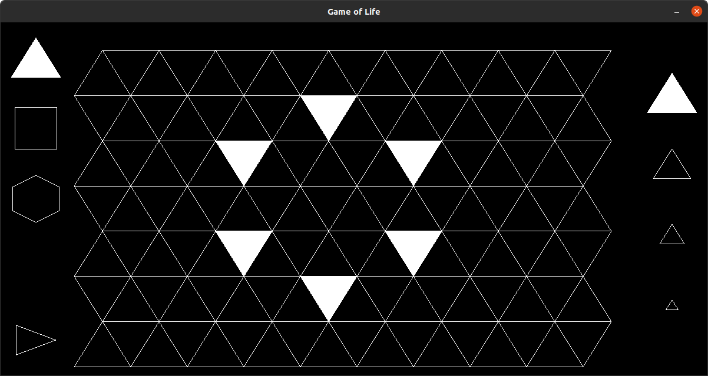
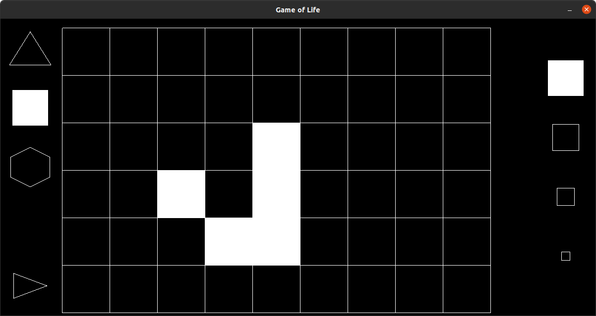
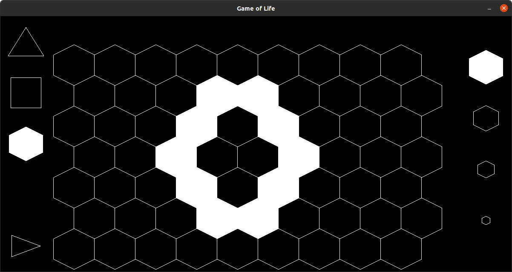

# Game_of_Life

With squares, triangles and hexes





Usage:
```
## Build and run with Make
make clean && make && make run

## Build manually with gcc / zig cc
gcc preprocessor.c -o preprocessor
./preprocessor
gcc src/main.c src/utils.c build/resources.c -o main -lGL -lcglm -lSDL3
./main
```
-lGL -lcglm -lSDL3 -lSDL3_ttf -lm


Define flags:
```
compiler flags: pkg-config --cflags sdl3
linker flags:   pkg-config --libs sdl3
compiler flags: pkg-config --cflags cglm
linker flags:   pkg-config --libs cglm
```

Debugging:
```
ulimit -c unlimited
sudo su
echo "./core" > /proc/sys/kernel/core_pattern
gcc -g -> Segmentation fault (core dumped)
gdb ./main ./core
ret -> bt (backtrace)
```

Usage of SDL3:
https://wiki.libsdl.org/SDL3/FrontPage
https://lazyfoo.net/tutorials/SDL/51_SDL_and_modern_opengl

Libraries:
https://github.com/libsdl-org/SDL
https://github.com/recp/cglm

Building SDL3 and SDL_ttf:
```
    git clone https://github.com/libsdl-org/SDL  ## SDL_ttf  ## SDL_image 
    cd SDL  ## SDL_ttf ## SDL_image
    mkdir build
    cd build

    ## Option 1
    cmake -DCMAKE_BUILD_TYPE=Release ..
    cmake --build . --config Release --parallel
    sudo cmake --install . --config Release

    ## Option 2
    ## `-DSDL_LIBC=ON` for sanitizer support
    cmake .. -DSDL_SHARED=ON -DSDL_LIBC=ON -DSDL_STATIC=OFF
    make -j$(nproc)
    sudo make install
    sudo ldconfig
```

in case of profile-version conflicts 
```
    sudo rm -rf /usr/local/lib/libSDL3*
    sudo rm -rf /usr/local/include/SDL3
    sudo rm -rf /usr/local/lib/cmake/SDL3

    cd SDL 
    git pull

    ## build again
```
